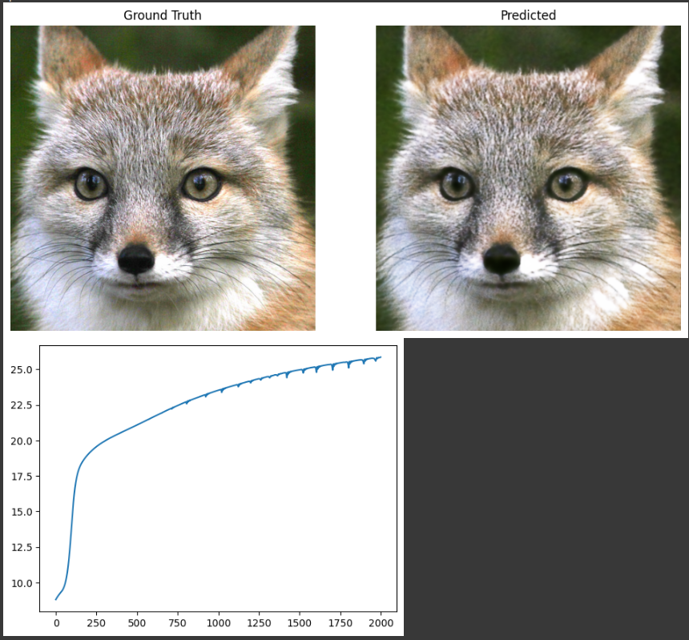

# 🖼️ Neural Image Representation using Fourier Features

This project demonstrates how a **neural network can represent an image** by learning a mapping from 2D pixel coordinates → RGB values. The approach is explored in two ways:

1. **Baseline MLP** using raw 2D coordinates.
2. **Fourier Feature MLP** using sinusoidal encodings to capture high-frequency details.

The entire workflow is implemented in a single **Jupyter Notebook**.

---

## 📂 Project Structure

```
├── Neural_Image_Representation.ipynb   # Main notebook (training & visualization)
├── image.jpg                           # Input image to reconstruct
└── README.md                           # Project documentation
```

---

## ⚙️ Installation & Setup

1. Clone this repository:

   ```bash
   git clone https://github.com/subratabiswas1/Neural-Image-Representation.git
   cd Neural-Image-Representation
   ```

2. Install the required Python libraries:

   ```bash
   pip install torch torchvision matplotlib numpy
   ```

3. Launch Jupyter Notebook:

   ```bash
   jupyter notebook Neural_Image_Representation.ipynb
   ```

---

## ▶️ Usage

Run the notebook cells step by step:

* Load the input image (`image.jpg`)
* Train the **baseline model** (raw coordinates)
* Train the **Fourier features model**
* Visualize reconstructions and **PSNR curves**

---

## 📊 Results

* **Baseline Model**: Learns a smooth but blurry approximation of the image.
* **Fourier Features Model**: Captures fine details, edges, and high-frequency structures, achieving much better visual quality and PSNR.

Example visualization (Ground Truth vs Reconstruction):



---

## 📖 References

* [Fourier Features Let Networks Learn High Frequency Functions in Low Dimensional Domains (Tancik et al., 2020)](https://arxiv.org/abs/2006.10739)
* [Implicit Neural Representations with Periodic Activation Functions (Sitzmann et al., 2020)](https://arxiv.org/abs/2006.09661)

---
